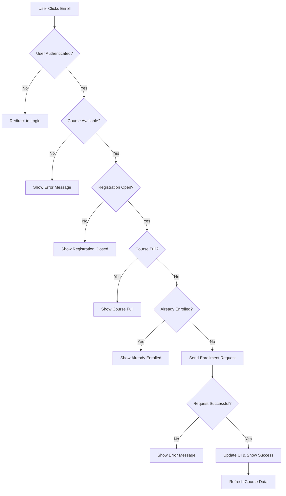

# Course Enrollment Flow - Complete Logic

## 🔄 **Enrollment Flow Overview**



---

## 🎯 **Step-by-Step Enrollment Logic**

### **1. Frontend Enrollment Trigger**

```javascript
// User clicks enroll button
const handleEnrollClick = async (courseId) => {
    console.log(`🎯 Starting enrollment process for course ${courseId}`);
    
    // Step 1: Check authentication
    if (!authManager.isAuthenticated()) {
        console.log('❌ User not authenticated, redirecting to login');
        showLoginPrompt();
        return;
    }
    
    // Step 2: Get course details for validation
    try {
        const course = await CourseService.getCourse(courseId);
        console.log('📋 Course details loaded:', course);
        
        // Step 3: Validate enrollment eligibility
        const validation = validateEnrollmentEligibility(course);
        if (!validation.canEnroll) {
            console.log('❌ Enrollment validation failed:', validation.reason);
            showEnrollmentError(validation.reason);
            return;
        }
        
        // Step 4: Show confirmation dialog
        const confirmed = await showEnrollmentConfirmation(course);
        if (!confirmed) {
            console.log('🚫 User cancelled enrollment');
            return;
        }
        
        // Step 5: Proceed with enrollment
        await processEnrollment(courseId);
        
    } catch (error) {
        console.error('💥 Error during enrollment process:', error);
        showEnrollmentError('Failed to load course details');
    }
};
```

### **2. Enrollment Eligibility Validation**

```javascript
const validateEnrollmentEligibility = (course) => {
    console.log('🔍 Validating enrollment eligibility...');
    
    // Check if course exists
    if (!course) {
        return {
            canEnroll: false,
            reason: 'Course not found',
            errorCode: 'COURSE_NOT_FOUND'
        };
    }
    
    // Check if course is published
    if (course.status !== 'published') {
        return {
            canEnroll: false,
            reason: 'Course is not available for enrollment',
            errorCode: 'COURSE_NOT_PUBLISHED'
        };
    }
    
    // Check if registration is open
    if (!course.is_registration_open) {
        const deadlineDate = new Date(course.registration_deadline);
        const now = new Date();
        
        if (now > deadlineDate) {
            return {
                canEnroll: false,
                reason: `Registration deadline has passed (${formatDate(deadlineDate)})`,
                errorCode: 'REGISTRATION_DEADLINE_PASSED'
            };
        } else {
            return {
                canEnroll: false,
                reason: 'Registration is not yet open',
                errorCode: 'REGISTRATION_NOT_OPEN'
            };
        }
    }
    
    // Check if course is full
    if (course.is_full) {
        return {
            canEnroll: false,
            reason: `Course is full (${course.current_enrollment}/${course.max_participants})`,
            errorCode: 'COURSE_FULL'
        };
    }
    
    // Check if user can register (backend validation)
    if (!course.can_register) {
        return {
            canEnroll: false,
            reason: 'You are not eligible to register for this course',
            errorCode: 'NOT_ELIGIBLE'
        };
    }
    
    console.log('✅ Enrollment eligibility validated successfully');
    return {
        canEnroll: true,
        reason: 'Eligible for enrollment'
    };
};
```

### **3. Enrollment Confirmation Dialog**

```javascript
const showEnrollmentConfirmation = async (course) => {
    return new Promise((resolve) => {
        const modal = document.createElement('div');
        modal.className = 'enrollment-modal';
        modal.innerHTML = `
            <div class="modal-overlay">
                <div class="modal-content">
                    <h3>Confirm Enrollment</h3>
                    <div class="course-summary">
                        <h4>${course.course_name}</h4>
                        <p><strong>Code:</strong> ${course.course_code}</p>
                        <p><strong>Instructor:</strong> ${course.instructor}</p>
                        <p><strong>Duration:</strong> ${course.training_hours} hours</p>
                        <p><strong>Dates:</strong> ${formatDate(course.start_date)} - ${formatDate(course.end_date)}</p>
                        <p><strong>Cost:</strong> ${course.is_free ? 'FREE' : formatCurrency(course.cost)}</p>
                        <p><strong>Available Spots:</strong> ${course.max_participants - course.current_enrollment}</p>
                    </div>
                    
                    ${course.prerequisites ? `
                        <div class="prerequisites">
                            <h5>Prerequisites:</h5>
                            <p>${course.prerequisites}</p>
                        </div>
                    ` : ''}
                    
                    <div class="modal-actions">
                        <button id="confirmEnroll" class="btn btn-primary">
                            Confirm Enrollment
                        </button>
                        <button id="cancelEnroll" class="btn btn-secondary">
                            Cancel
                        </button>
                    </div>
                </div>
            </div>
        `;
        
        document.body.appendChild(modal);
        
        // Handle confirmation
        document.getElementById('confirmEnroll').onclick = () => {
            document.body.removeChild(modal);
            resolve(true);
        };
        
        // Handle cancellation
        document.getElementById('cancelEnroll').onclick = () => {
            document.body.removeChild(modal);
            resolve(false);
        };
        
        // Handle overlay click
        modal.querySelector('.modal-overlay').onclick = (e) => {
            if (e.target === e.currentTarget) {
                document.body.removeChild(modal);
                resolve(false);
            }
        };
    });
};
```

### **4. Process Enrollment Request**

```javascript
const processEnrollment = async (courseId) => {
    console.log(`📤 Sending enrollment request for course ${courseId}`);
    
    // Show loading state
    showEnrollmentLoading(true);
    
    try {
        // Make API request
        const response = await fetch(`${COURSES_ENDPOINT}${courseId}/enroll/`, {
            method: 'POST',
            headers: {
                'Authorization': `Bearer ${authManager.getAccessToken()}`,
                'Content-Type': 'application/json',
                'Accept': 'application/json'
            }
        });
        
        console.log(`📥 Enrollment response status: ${response.status}`);
        
        if (!response.ok) {
            const errorData = await response.json();
            throw new EnrollmentError(errorData, response.status);
        }
        
        const enrollmentData = await response.json();
        console.log('✅ Enrollment successful:', enrollmentData);
        
        // Handle successful enrollment
        await handleEnrollmentSuccess(courseId, enrollmentData);
        
    } catch (error) {
        console.error('❌ Enrollment failed:', error);
        await handleEnrollmentError(error);
    } finally {
        showEnrollmentLoading(false);
    }
};
```

### **5. Handle Enrollment Success**

```javascript
const handleEnrollmentSuccess = async (courseId, enrollmentData) => {
    console.log('🎉 Processing successful enrollment...');
    
    // Update local course data
    await updateCourseData(courseId);
    
    // Show success message
    showSuccessMessage({
        title: 'Enrollment Successful!',
        message: `You have been successfully enrolled in the course.`,
        details: {
            enrollmentId: enrollmentData.id,
            enrollmentDate: enrollmentData.created_at,
            status: enrollmentData.status
        }
    });
    
    // Update UI elements
    updateEnrollmentButton(courseId, 'enrolled');
    updateCourseStats(courseId);
    
    // Send analytics event
    if (window.analytics) {
        window.analytics.track('Course Enrolled', {
            courseId: courseId,
            courseName: enrollmentData.course_title,
            enrollmentId: enrollmentData.id
        });
    }
    
    // Refresh user's enrolled courses list
    if (window.userDashboard) {
        window.userDashboard.refreshEnrolledCourses();
    }
    
    console.log('✅ Enrollment success handling completed');
};
```

### **6. Handle Enrollment Errors**

```javascript
const handleEnrollmentError = async (error) => {
    console.log('💥 Processing enrollment error...');
    
    let errorMessage = 'An unexpected error occurred during enrollment.';
    let errorCode = 'UNKNOWN_ERROR';
    
    if (error instanceof EnrollmentError) {
        switch (error.status) {
            case 400:
                // Validation errors from backend
                if (error.data.error) {
                    errorMessage = error.data.error;
                    errorCode = 'VALIDATION_ERROR';
                } else if (error.data.detail) {
                    errorMessage = error.data.detail;
                    errorCode = 'BAD_REQUEST';
                }
                break;
                
            case 401:
                errorMessage = 'Authentication required. Please login and try again.';
                errorCode = 'AUTHENTICATION_REQUIRED';
                // Clear tokens and redirect to login
                authManager.logout();
                setTimeout(() => {
                    window.location.href = '/login?redirect=' + encodeURIComponent(window.location.pathname);
                }, 2000);
                break;
                
            case 403:
                errorMessage = 'You do not have permission to enroll in this course.';
                errorCode = 'PERMISSION_DENIED';
                break;
                
            case 404:
                errorMessage = 'Course not found or no longer available.';
                errorCode = 'COURSE_NOT_FOUND';
                break;
                
            case 409:
                errorMessage = 'You are already enrolled in this course.';
                errorCode = 'ALREADY_ENROLLED';
                break;
                
            case 422:
                errorMessage = 'Course is full or registration is closed.';
                errorCode = 'ENROLLMENT_NOT_AVAILABLE';
                break;
                
            case 500:
                errorMessage = 'Server error occurred. Please try again later.';
                errorCode = 'SERVER_ERROR';
                break;
        }
    }
    
    // Show error message
    showErrorMessage({
        title: 'Enrollment Failed',
        message: errorMessage,
        errorCode: errorCode,
        canRetry: error.status !== 403 && error.status !== 404
    });
    
    // Log error for debugging
    console.error('Enrollment error details:', {
        errorCode,
        status: error.status,
        message: errorMessage,
        originalError: error
    });
    
    // Send error analytics
    if (window.analytics) {
        window.analytics.track('Course Enrollment Failed', {
            errorCode,
            errorMessage,
            status: error.status
        });
    }
};
```

---

## 🔧 **Backend Enrollment Logic**

### **Django View Method (training/views.py)**

```python
@action(detail=True, methods=['post'], permission_classes=[IsAuthenticated])
def enroll(self, request, pk=None):
    """Enroll user in course"""
    print(f"🎯 Enrollment request for course {pk} by user {request.user.id}")
    
    try:
        course = self.get_object()
        user = request.user
        
        # Step 1: Check if user can register
        if not course.can_register():
            print(f"❌ Course {pk} registration not available")
            return Response(
                {'error': 'Registration is not open for this course'},
                status=status.HTTP_400_BAD_REQUEST
            )
        
        # Step 2: Check if already enrolled
        existing_enrollment = CourseEnrollment.objects.filter(
            course=course, 
            student=user
        ).first()
        
        if existing_enrollment:
            print(f"❌ User {user.id} already enrolled in course {pk}")
            return Response(
                {'error': 'You are already enrolled in this course'},
                status=status.HTTP_409_CONFLICT
            )
        
        # Step 3: Check course capacity
        if course.is_full:
            print(f"❌ Course {pk} is full")
            return Response(
                {'error': 'Course is full'},
                status=status.HTTP_422_UNPROCESSABLE_ENTITY
            )
        
        # Step 4: Create enrollment
        with transaction.atomic():
            enrollment = CourseEnrollment.objects.create(
                course=course,
                student=user,
                status='approved',  # Auto-approve or set to 'pending'
                enrollment_date=timezone.now()
            )
            
            # Step 5: Update course enrollment count
            course.current_enrollment = F('current_enrollment') + 1
            course.save(update_fields=['current_enrollment'])
            
            print(f"✅ User {user.id} successfully enrolled in course {pk}")
        
        # Step 6: Send confirmation email (optional)
        try:
            send_enrollment_confirmation_email(user, course, enrollment)
        except Exception as e:
            print(f"⚠️ Failed to send confirmation email: {e}")
            # Don't fail the enrollment if email fails
        
        # Step 7: Return success response
        serializer = CourseEnrollmentSerializer(enrollment)
        return Response({
            'message': 'Successfully enrolled in course',
            'enrollment': serializer.data
        }, status=status.HTTP_201_CREATED)
        
    except Course.DoesNotExist:
        print(f"❌ Course {pk} not found")
        return Response(
            {'error': 'Course not found'},
            status=status.HTTP_404_NOT_FOUND
        )
    except Exception as e:
        print(f"💥 Unexpected error during enrollment: {e}")
        return Response(
            {'error': 'An unexpected error occurred'},
            status=status.HTTP_500_INTERNAL_SERVER_ERROR
        )
```

### **Course Model Methods (training/models.py)**

```python
def can_register(self):
    """Check if new registrations are allowed"""
    print(f"🔍 Checking registration eligibility for course {self.id}")
    
    # Check if course is published
    if self.status != StatusChoices.PUBLISHED:
        print(f"❌ Course {self.id} not published (status: {self.status})")
        return False
    
    # Check if registration is open
    if not self.is_registration_open:
        print(f"❌ Registration closed for course {self.id}")
        return False
    
    # Check if course is full
    if self.is_full:
        print(f"❌ Course {self.id} is full ({self.current_enrollment}/{self.max_participants})")
        return False
    
    # Check if course is public
    if not self.is_public:
        print(f"❌ Course {self.id} is not public")
        return False
    
    print(f"✅ Course {self.id} is available for registration")
    return True

@property
def is_registration_open(self):
    """Check if registration is still open"""
    return (
        self.status == StatusChoices.PUBLISHED and
        timezone.now().date() <= self.registration_deadline
    )

@property
def is_full(self):
    """Check if course is at capacity"""
    return self.current_enrollment >= self.max_participants

---

## 📊 **Database Operations**

### **CourseEnrollment Model**

```python
class CourseEnrollment(TimeStampedModel):
    """Model for course enrollments"""

    ENROLLMENT_STATUS = [
        ('pending', 'Pending'),
        ('approved', 'Approved'),
        ('rejected', 'Rejected'),
        ('completed', 'Completed'),
        ('cancelled', 'Cancelled'),
    ]

    course = models.ForeignKey(
        Course,
        on_delete=models.CASCADE,
        related_name='enrollments'
    )
    student = models.ForeignKey(
        'accounts.User',
        on_delete=models.CASCADE,
        related_name='course_enrollments'
    )
    status = models.CharField(
        max_length=20,
        choices=ENROLLMENT_STATUS,
        default='pending'
    )
    enrollment_date = models.DateTimeField(auto_now_add=True)
    completion_date = models.DateTimeField(null=True, blank=True)
    grade = models.CharField(max_length=5, blank=True)
    notes = models.TextField(blank=True)

    class Meta:
        unique_together = ['course', 'student']
        ordering = ['-enrollment_date']

    def __str__(self):
        return f"{self.student.get_full_name()} - {self.course.course_name}"

    @property
    def is_active(self):
        """Check if enrollment is active"""
        return self.status in ['approved', 'completed']

    def complete_enrollment(self, grade=None):
        """Mark enrollment as completed"""
        self.status = 'completed'
        self.completion_date = timezone.now()
        if grade:
            self.grade = grade
        self.save()
```

### **Database Queries During Enrollment**

```python
# 1. Check existing enrollment
existing_enrollment = CourseEnrollment.objects.filter(
    course_id=course_id,
    student=user
).exists()

# 2. Get course with enrollment count
course = Course.objects.select_related('department').annotate(
    enrollments_count=Count('enrollments', filter=Q(enrollments__status='approved'))
).get(id=course_id)

# 3. Create enrollment with atomic transaction
with transaction.atomic():
    enrollment = CourseEnrollment.objects.create(
        course=course,
        student=user,
        status='approved'
    )

    # Update course enrollment count
    Course.objects.filter(id=course_id).update(
        current_enrollment=F('current_enrollment') + 1
    )

# 4. Get user's enrollments
user_enrollments = CourseEnrollment.objects.filter(
    student=user,
    status__in=['approved', 'completed']
).select_related('course')
```

---

## 🔔 **Notifications & Email**

### **Email Confirmation**

```python
def send_enrollment_confirmation_email(user, course, enrollment):
    """Send enrollment confirmation email"""
    print(f"📧 Sending enrollment confirmation to {user.email}")

    subject = f"Enrollment Confirmation - {course.course_name}"

    context = {
        'user': user,
        'course': course,
        'enrollment': enrollment,
        'enrollment_date': enrollment.enrollment_date,
        'course_start_date': course.start_date,
        'course_end_date': course.end_date,
        'instructor': course.instructor,
        'course_url': f"{settings.FRONTEND_URL}/courses/{course.id}",
    }

    # HTML email template
    html_message = render_to_string('emails/enrollment_confirmation.html', context)
    plain_message = render_to_string('emails/enrollment_confirmation.txt', context)

    send_mail(
        subject=subject,
        message=plain_message,
        from_email=settings.DEFAULT_FROM_EMAIL,
        recipient_list=[user.email],
        html_message=html_message,
        fail_silently=False
    )

    print(f"✅ Enrollment confirmation email sent to {user.email}")
```

### **Email Templates**

**enrollment_confirmation.html:**
```html
<!DOCTYPE html>
<html>
<head>
    <title>Enrollment Confirmation</title>
</head>
<body>
    <div style="max-width: 600px; margin: 0 auto; font-family: Arial, sans-serif;">
        <h2>🎉 Enrollment Confirmed!</h2>

        <p>Dear {{ user.get_full_name }},</p>

        <p>You have been successfully enrolled in:</p>

        <div style="background: #f8f9fa; padding: 20px; border-radius: 8px; margin: 20px 0;">
            <h3>{{ course.course_name }}</h3>
            <p><strong>Course Code:</strong> {{ course.course_code }}</p>
            <p><strong>Instructor:</strong> {{ course.instructor }}</p>
            <p><strong>Start Date:</strong> {{ course.start_date|date:"F d, Y" }}</p>
            <p><strong>End Date:</strong> {{ course.end_date|date:"F d, Y" }}</p>
            <p><strong>Duration:</strong> {{ course.training_hours }} hours</p>
            
                <p><strong>Cost:</strong> ${{ course.cost }}</p>
            
        </div>

        <p><strong>Enrollment Details:</strong></p>
        <ul>
            <li>Enrollment ID: {{ enrollment.id }}</li>
            <li>Enrollment Date: {{ enrollment_date|date:"F d, Y g:i A" }}</li>
            <li>Status: {{ enrollment.get_status_display }}</li>
        </ul>

        
        <div style="background: #fff3cd; padding: 15px; border-radius: 8px; margin: 20px 0;">
            <h4>📋 Prerequisites:</h4>
            <p>{{ course.prerequisites }}</p>
        </div>
        

        <div style="margin: 30px 0;">
            <a href="{{ course_url }}"
               style="background: #007bff; color: white; padding: 12px 24px;
                      text-decoration: none; border-radius: 4px; display: inline-block;">
                View Course Details
            </a>
        </div>

        <p>If you have any questions, please contact us at support@example.com</p>

        <p>Best regards,<br>The Training Team</p>
    </div>
</body>
</html>
```

---

## 🎨 **Frontend UI Components**

### **Enrollment Button Component**

```javascript
class EnrollmentButton {
    constructor(courseId, containerId) {
        this.courseId = courseId;
        this.container = document.getElementById(containerId);
        this.course = null;
        this.init();
    }

    async init() {
        await this.loadCourseData();
        this.render();
        this.bindEvents();
    }

    async loadCourseData() {
        try {
            this.course = await CourseService.getCourse(this.courseId);
        } catch (error) {
            console.error('Failed to load course data:', error);
        }
    }

    render() {
        if (!this.course) {
            this.container.innerHTML = '<p>Course not available</p>';
            return;
        }

        const buttonState = this.getButtonState();

        this.container.innerHTML = `
            <div class="enrollment-section">
                <div class="course-status">
                    <div class="enrollment-stats">
                        <span class="enrolled-count">${this.course.current_enrollment}</span>
                        <span class="separator">/</span>
                        <span class="max-participants">${this.course.max_participants}</span>
                        <span class="participants-label">participants</span>
                    </div>

                    <div class="progress-bar">
                        <div class="progress-fill"
                             style="width: ${this.course.enrollment_percentage}%">
                        </div>
                    </div>

                    <div class="availability-info">
                        <span class="spots-remaining">
                            ${this.course.max_participants - this.course.current_enrollment} spots remaining
                        </span>
                    </div>
                </div>

                <div class="enrollment-action">
                    ${this.renderButton(buttonState)}
                </div>

                ${this.renderAdditionalInfo()}
            </div>
        `;
    }

    getButtonState() {
        if (!authManager.isAuthenticated()) {
            return {
                type: 'login',
                text: 'Login to Enroll',
                disabled: false,
                className: 'btn-secondary'
            };
        }

        if (this.course.status !== 'published') {
            return {
                type: 'unavailable',
                text: 'Not Available',
                disabled: true,
                className: 'btn-disabled'
            };
        }

        if (!this.course.is_registration_open) {
            return {
                type: 'closed',
                text: 'Registration Closed',
                disabled: true,
                className: 'btn-disabled'
            };
        }

        if (this.course.is_full) {
            return {
                type: 'full',
                text: 'Course Full',
                disabled: true,
                className: 'btn-disabled'
            };
        }

        if (this.isUserEnrolled()) {
            return {
                type: 'enrolled',
                text: 'Already Enrolled',
                disabled: true,
                className: 'btn-success'
            };
        }

        return {
            type: 'enroll',
            text: 'Enroll Now',
            disabled: false,
            className: 'btn-primary'
        };
    }

    renderButton(buttonState) {
        return `
            <button
                id="enrollBtn-${this.courseId}"
                class="enrollment-btn ${buttonState.className}"
                ${buttonState.disabled ? 'disabled' : ''}
                data-action="${buttonState.type}"
            >
                ${buttonState.text}
            </button>
        `;
    }

    renderAdditionalInfo() {
        let info = '';

        if (this.course.cost && !this.course.is_free) {
            info += `
                <div class="cost-info">
                    <span class="cost-label">Course Fee:</span>
                    <span class="cost-amount">${formatCurrency(this.course.cost)}</span>
                </div>
            `;
        } else {
            info += `
                <div class="cost-info">
                    <span class="free-badge">FREE</span>
                </div>
            `;
        }

        if (this.course.registration_deadline) {
            const deadline = new Date(this.course.registration_deadline);
            const now = new Date();
            const daysLeft = Math.ceil((deadline - now) / (1000 * 60 * 60 * 24));

            if (daysLeft > 0) {
                info += `
                    <div class="deadline-info">
                        <span class="deadline-label">Registration ends in:</span>
                        <span class="deadline-countdown">${daysLeft} days</span>
                    </div>
                `;
            }
        }

        return `<div class="additional-info">${info}</div>`;
    }

    bindEvents() {
        const button = document.getElementById(`enrollBtn-${this.courseId}`);
        if (button) {
            button.addEventListener('click', (e) => {
                const action = e.target.dataset.action;
                this.handleButtonClick(action);
            });
        }
    }

    async handleButtonClick(action) {
        switch (action) {
            case 'login':
                window.location.href = '/login?redirect=' + encodeURIComponent(window.location.pathname);
                break;

            case 'enroll':
                await this.handleEnrollment();
                break;

            default:
                // Do nothing for disabled states
                break;
        }
    }

    async handleEnrollment() {
        try {
            // Show loading state
            this.setButtonLoading(true);

            // Process enrollment
            await processEnrollment(this.courseId);

            // Refresh course data and re-render
            await this.loadCourseData();
            this.render();
            this.bindEvents();

        } catch (error) {
            console.error('Enrollment failed:', error);
        } finally {
            this.setButtonLoading(false);
        }
    }

    setButtonLoading(loading) {
        const button = document.getElementById(`enrollBtn-${this.courseId}`);
        if (button) {
            if (loading) {
                button.disabled = true;
                button.innerHTML = 'Enrolling...';
                button.classList.add('loading');
            } else {
                button.disabled = false;
                button.classList.remove('loading');
            }
        }
    }

    isUserEnrolled() {
        // This would typically check against user's enrollment data
        // For now, we'll use the course's can_register property
        return !this.course.can_register && this.course.is_registration_open && !this.course.is_full;
    }
}

// Usage
const enrollmentButton = new EnrollmentButton(courseId, 'enrollment-container');
```

---

## 📱 **Mobile-Responsive Enrollment**

### **CSS for Enrollment Components**

```css
.enrollment-section {
    background: #f8f9fa;
    border-radius: 8px;
    padding: 20px;
    margin: 20px 0;
}

.course-status {
    margin-bottom: 20px;
}

.enrollment-stats {
    display: flex;
    align-items: center;
    gap: 5px;
    margin-bottom: 10px;
}

.enrolled-count {
    font-size: 24px;
    font-weight: bold;
    color: #007bff;
}

.max-participants {
    font-size: 18px;
    color: #6c757d;
}

.progress-bar {
    width: 100%;
    height: 8px;
    background: #e9ecef;
    border-radius: 4px;
    overflow: hidden;
    margin-bottom: 10px;
}

.progress-fill {
    height: 100%;
    background: linear-gradient(90deg, #007bff, #0056b3);
    transition: width 0.3s ease;
}

.enrollment-btn {
    width: 100%;
    padding: 12px 24px;
    font-size: 16px;
    font-weight: 600;
    border: none;
    border-radius: 6px;
    cursor: pointer;
    transition: all 0.3s ease;
}

.btn-primary {
    background: #007bff;
    color: white;
}

.btn-primary:hover:not(:disabled) {
    background: #0056b3;
    transform: translateY(-1px);
}

.btn-secondary {
    background: #6c757d;
    color: white;
}

.btn-success {
    background: #28a745;
    color: white;
}

.btn-disabled {
    background: #e9ecef;
    color: #6c757d;
    cursor: not-allowed;
}

.enrollment-btn.loading {
    position: relative;
    color: transparent;
}

.enrollment-btn.loading::after {
    content: '';
    position: absolute;
    top: 50%;
    left: 50%;
    width: 20px;
    height: 20px;
    margin: -10px 0 0 -10px;
    border: 2px solid transparent;
    border-top: 2px solid currentColor;
    border-radius: 50%;
    animation: spin 1s linear infinite;
}

@keyframes spin {
    0% { transform: rotate(0deg); }
    100% { transform: rotate(360deg); }
}

.additional-info {
    margin-top: 15px;
    padding-top: 15px;
    border-top: 1px solid #dee2e6;
}

.cost-info, .deadline-info {
    display: flex;
    justify-content: space-between;
    align-items: center;
    margin-bottom: 8px;
}

.free-badge {
    background: #28a745;
    color: white;
    padding: 4px 8px;
    border-radius: 4px;
    font-size: 12px;
    font-weight: bold;
}

.deadline-countdown {
    background: #ffc107;
    color: #000;
    padding: 2px 6px;
    border-radius: 4px;
    font-size: 12px;
    font-weight: bold;
}

/* Mobile Responsive */
@media (max-width: 768px) {
    .enrollment-section {
        padding: 15px;
        margin: 15px 0;
    }

    .enrollment-btn {
        padding: 14px 20px;
        font-size: 18px;
    }

    .enrolled-count {
        font-size: 20px;
    }

    .cost-info, .deadline-info {
        flex-direction: column;
        align-items: flex-start;
        gap: 5px;
    }
}
```

---

## 🔍 **Testing the Enrollment Flow**

### **Manual Testing Checklist**

```javascript
// Test scenarios for enrollment flow
const enrollmentTestScenarios = [
    {
        name: "Successful Enrollment",
        setup: "Published course with available spots, authenticated user",
        expected: "User enrolled successfully, UI updated, confirmation shown"
    },
    {
        name: "Unauthenticated User",
        setup: "User not logged in",
        expected: "Redirect to login page"
    },
    {
        name: "Course Full",
        setup: "Course at maximum capacity",
        expected: "Show 'Course Full' message, disable enrollment"
    },
    {
        name: "Registration Closed",
        setup: "Past registration deadline",
        expected: "Show 'Registration Closed' message"
    },
    {
        name: "Already Enrolled",
        setup: "User already enrolled in course",
        expected: "Show 'Already Enrolled' status"
    },
    {
        name: "Course Not Published",
        setup: "Course in draft status",
        expected: "Show 'Not Available' message"
    },
    {
        name: "Network Error",
        setup: "API request fails",
        expected: "Show error message, allow retry"
    },
    {
        name: "Server Error",
        setup: "Backend returns 500 error",
        expected: "Show generic error message"
    }
];

// Automated test function
async function testEnrollmentFlow(courseId) {
    console.log('🧪 Starting enrollment flow tests...');

    for (const scenario of enrollmentTestScenarios) {
        console.log(`Testing: ${scenario.name}`);

        try {
            // Setup test conditions
            await setupTestScenario(scenario);

            // Execute enrollment
            const result = await processEnrollment(courseId);

            // Verify expected outcome
            const passed = await verifyTestResult(scenario, result);

            console.log(`${passed ? '✅' : '❌'} ${scenario.name}: ${passed ? 'PASSED' : 'FAILED'}`);

        } catch (error) {
            console.log(`❌ ${scenario.name}: ERROR - ${error.message}`);
        }
    }

    console.log('🧪 Enrollment flow tests completed');
}
```

This comprehensive enrollment flow covers every aspect from the initial user click to the final database update and email confirmation. The flow includes proper error handling, validation at multiple levels, and a responsive UI that provides clear feedback to users throughout the process.
```
