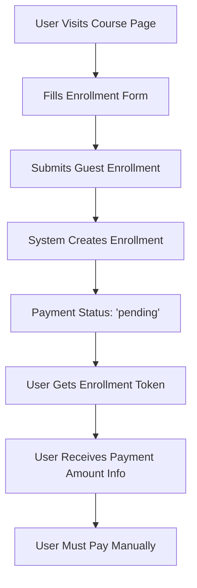
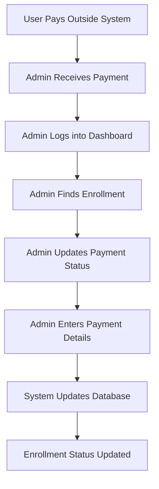

# 💳 Course Payment Flow Guide

## 🎯 **Current Payment System Overview**

The current payment system is **manual and admin-managed**. There's no automated payment gateway integration - payments are tracked and updated manually by administrators.

---

## 📊 **Current Payment Flow**

### **Phase 1: Guest Enrollment (No Payment Required)**


### **Phase 2: Manual Payment Processing**


---

## 🗄️ **Payment Data Structure**

### **CourseEnrollment Payment Fields**
```python
class CourseEnrollment(models.Model):
    # Payment information
    payment_status = models.CharField(
        max_length=20,
        choices=PaymentStatus.choices,
        default=PaymentStatus.PENDING  # 'pending'
    )
    payment_amount = models.DecimalField(
        max_digits=10,
        decimal_places=2,
        default=Decimal('0.00')
    )
    payment_date = models.DateTimeField(null=True, blank=True)
    payment_reference = models.CharField(max_length=100, blank=True)
```

### **Payment Status Options**
```python
class PaymentStatus(models.TextChoices):
    PENDING = 'pending', 'Pending'
    PAID = 'paid', 'Paid'
    FAILED = 'failed', 'Failed'
    REFUNDED = 'refunded', 'Refunded'
```

---

## 🔄 **Step-by-Step Payment Flow**

### **1. Guest Enrollment**
```bash
# User enrolls in course
curl -X POST /api/training/courses/6/enroll/ \
  -H "Content-Type: application/json" \
  -d '{
    "first_name": "John",
    "last_name": "Doe",
    "email": "john@example.com",
    "phone": "123456789"
  }'
```

**Response:**
```json
{
  "message": "Successfully enrolled in course",
  "enrollment": {
    "id": 15,
    "payment_status": "pending",
    "payment_amount": "0.00",
    "enrollment_token": "648b964e-9639-4066-be41-3c4cd03f1f47"
  },
  "payment_amount": 500.0,  // Course cost
  "next_steps": [
    "Save your enrollment ID for future reference",
    "Check course start date and prepare materials",
    "Contact support if you have questions"
  ]
}
```

### **2. User Payment (Outside System)**
- User receives enrollment confirmation with payment amount
- User pays via:
  - Bank transfer
  - Cash payment
  - Credit card (offline)
  - Mobile payment
  - Any other method

### **3. Admin Payment Processing**
```javascript
// Admin updates payment status
const updatePayment = async (enrollmentId, paymentData) => {
  const response = await fetch(`/api/training/enrollments/${enrollmentId}/`, {
    method: 'PUT',
    headers: {
      'Authorization': `Bearer ${adminToken}`,
      'Content-Type': 'application/json'
    },
    body: JSON.stringify({
      payment_status: 'paid',
      payment_amount: '500.00',
      payment_date: '2025-07-31T20:30:00Z',
      payment_reference: 'BANK_TXN_123456'
    })
  });
  
  return response.json();
};
```

---

## 🎨 **Frontend Payment Management**

### **Admin Payment Update Form**
```jsx
const PaymentUpdateForm = ({ enrollment, onUpdate }) => {
  const [paymentData, setPaymentData] = useState({
    payment_status: enrollment.payment_status,
    payment_amount: enrollment.payment_amount,
    payment_reference: enrollment.payment_reference || ''
  });

  const handleSubmit = async (e) => {
    e.preventDefault();
    
    try {
      const response = await fetch(`/api/training/enrollments/${enrollment.id}/`, {
        method: 'PUT',
        headers: {
          'Authorization': `Bearer ${getToken()}`,
          'Content-Type': 'application/json'
        },
        body: JSON.stringify({
          ...paymentData,
          payment_date: new Date().toISOString()
        })
      });
      
      if (response.ok) {
        onUpdate();
        alert('Payment updated successfully!');
      }
    } catch (error) {
      alert('Failed to update payment');
    }
  };

  return (
    <form onSubmit={handleSubmit}>
      <div>
        <label>Payment Status</label>
        <select
          value={paymentData.payment_status}
          onChange={(e) => setPaymentData({
            ...paymentData,
            payment_status: e.target.value
          })}
        >
          <option value="pending">Pending</option>
          <option value="paid">Paid</option>
          <option value="failed">Failed</option>
          <option value="refunded">Refunded</option>
        </select>
      </div>
      
      <div>
        <label>Payment Amount</label>
        <input
          type="number"
          step="0.01"
          value={paymentData.payment_amount}
          onChange={(e) => setPaymentData({
            ...paymentData,
            payment_amount: e.target.value
          })}
        />
      </div>
      
      <div>
        <label>Payment Reference</label>
        <input
          type="text"
          value={paymentData.payment_reference}
          onChange={(e) => setPaymentData({
            ...paymentData,
            payment_reference: e.target.value
          })}
          placeholder="Transaction ID, receipt number, etc."
        />
      </div>
      
      <button type="submit">Update Payment</button>
    </form>
  );
};
```

### **Payment Status Display**
```jsx
const PaymentStatusBadge = ({ status, amount }) => {
  const getStatusColor = (status) => {
    switch (status) {
      case 'paid': return 'green';
      case 'pending': return 'orange';
      case 'failed': return 'red';
      case 'refunded': return 'blue';
      default: return 'gray';
    }
  };

  return (
    <div className="payment-status">
      <span 
        className={`status-badge ${getStatusColor(status)}`}
        style={{ backgroundColor: getStatusColor(status) }}
      >
        {status.toUpperCase()}
      </span>
      <span className="amount">${amount}</span>
    </div>
  );
};
```

---

## 📋 **Current API Endpoints**

### **Available Endpoints**
```
GET    /api/training/enrollments/           # List enrollments (with payment info)
GET    /api/training/enrollments/{id}/      # Get enrollment details
PUT    /api/training/enrollments/{id}/      # Update enrollment (including payment)
DELETE /api/training/enrollments/{id}/      # Delete enrollment
```

### **Payment Filtering**
```javascript
// Filter enrollments by payment status
const getPendingPayments = async () => {
  const response = await fetch('/api/training/enrollments/?payment_status=pending', {
    headers: { 'Authorization': `Bearer ${token}` }
  });
  return response.json();
};

const getPaidEnrollments = async () => {
  const response = await fetch('/api/training/enrollments/?payment_status=paid', {
    headers: { 'Authorization': `Bearer ${token}` }
  });
  return response.json();
};
```

---

## ⚠️ **Current Limitations**

### **❌ What's Missing:**
1. **No Payment Gateway Integration** - No Stripe, PayPal, etc.
2. **No Automated Payment Processing** - All manual
3. **No Payment Notifications** - No email/SMS alerts
4. **No Payment Receipts** - No automatic receipt generation
5. **No Refund Processing** - Manual refund tracking only
6. **No Payment Validation** - No verification of payment amounts
7. **No Payment Deadlines** - No overdue payment tracking

### **✅ What's Working:**
1. **Payment Status Tracking** - Manual status updates
2. **Payment Amount Storage** - Stores payment amounts
3. **Payment Reference Storage** - Stores transaction references
4. **Payment Date Tracking** - Records when payments are processed
5. **Admin Payment Management** - Admins can update payment info
6. **Payment Filtering** - Can filter enrollments by payment status

---

## 🚀 **Recommended Improvements**

### **1. Add Payment Gateway Integration**
```python
# Add to CourseEnrollmentViewSet
@action(detail=True, methods=['post'])
def process_payment(self, request, pk=None):
    """Process payment via payment gateway"""
    enrollment = self.get_object()
    
    # Integrate with Stripe/PayPal
    payment_result = payment_gateway.charge(
        amount=enrollment.course.cost,
        currency='USD',
        source=request.data.get('payment_token'),
        description=f"Course: {enrollment.course.course_name}"
    )
    
    if payment_result.success:
        enrollment.payment_status = 'paid'
        enrollment.payment_amount = payment_result.amount
        enrollment.payment_reference = payment_result.transaction_id
        enrollment.payment_date = timezone.now()
        enrollment.save()
        
        return Response({'success': True, 'transaction_id': payment_result.transaction_id})
    else:
        return Response({'success': False, 'error': payment_result.error})
```

### **2. Add Payment Deadline Tracking**
```python
# Add to CourseEnrollment model
payment_deadline = models.DateTimeField(null=True, blank=True)

@property
def is_payment_overdue(self):
    if self.payment_deadline and self.payment_status == 'pending':
        return timezone.now() > self.payment_deadline
    return False
```

### **3. Add Automated Payment Reminders**
```python
# Management command for payment reminders
def send_payment_reminders():
    overdue_enrollments = CourseEnrollment.objects.filter(
        payment_status='pending',
        payment_deadline__lt=timezone.now()
    )
    
    for enrollment in overdue_enrollments:
        send_payment_reminder_email(enrollment)
```

---

## 🎯 **Summary**

### **Current State:**
- ✅ **Basic payment tracking** with manual admin updates
- ✅ **Payment status management** (pending, paid, failed, refunded)
- ✅ **Payment amount and reference storage**
- ✅ **Admin dashboard for payment management**

### **Payment Process:**
1. **User enrolls** → Payment status: "pending"
2. **User pays outside system** → Via bank transfer, cash, etc.
3. **Admin receives payment** → Updates system manually
4. **Payment status updated** → "paid" with reference number

### **For Production Use:**
- **Current system works** for manual payment processing
- **Suitable for** small-scale operations with offline payments
- **Requires** dedicated admin staff for payment management
- **Consider upgrading** to automated payment gateway for scale

**The payment system is functional but manual - perfect for organizations that handle payments offline!** 💳✨
