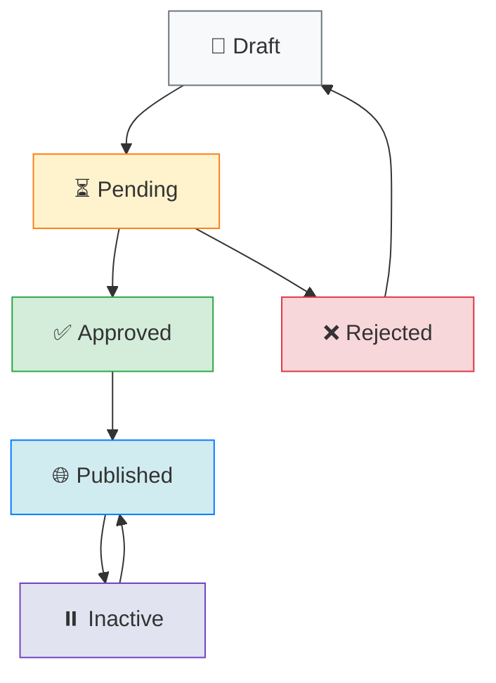

# Frontend Post Update Guide

## 🎯 **Overview**

This guide provides everything your frontend developers need to implement post updating functionality. The system supports both text-only updates and file uploads with proper validation and error handling.

---

## 🔗 **API Endpoints**

### **Base URL**
```
http://127.0.0.1:8000/api/content/
```

### **Update Endpoints**
| Method | Endpoint | Description | Use Case |
|--------|----------|-------------|----------|
| `PATCH` | `/posts/{id}/` | Partial update | Update specific fields only ⭐ **Recommended** |
| `PUT` | `/posts/{id}/` | Full update | Replace entire post |
| `GET` | `/posts/{id}/` | Get post details | Fetch current post data |

### **Authentication Headers**
```javascript
const headers = {
  'Authorization': `Bearer ${accessToken}`,
  'Content-Type': 'application/json' // For JSON requests only
};
```

---

## 📊 **Post Data Structure**

### **Complete Post Object**
```javascript
{
  "id": 15,
  "title": "Research Workshop on AI",
  "content": "Join us for an exciting workshop on artificial intelligence...", // ✅ Now included in list view
  "excerpt": "AI workshop for researchers and students",
  "category": "workshop",
  "tags": "AI, research, workshop, technology",
  "status": "published",
  "author": {
    "id": 2,
    "username": "admin",
    "full_name": "Admin User"
  },
  "publish_at": "2025-08-01T09:00:00Z",
  "is_featured": true,
  "is_public": true,
  "view_count": 45,
  "like_count": 12,
  
  // Event-specific fields
  "event_date": "2025-08-15T14:00:00Z",
  "event_location": "Main Conference Room",
  "registration_required": true,
  "registration_deadline": "2025-08-10T23:59:59Z",
  "max_participants": 50,
  "current_participants": 23,
  
  // File attachments
  "featured_image": "http://127.0.0.1:8000/media/posts/featured/workshop_ai.jpg",
  "attachment": "http://127.0.0.1:8000/media/posts/attachments/workshop_agenda.pdf",
  
  // Metadata
  "created_at": "2025-07-31T10:30:00Z",
  "updated_at": "2025-07-31T15:45:00Z"
}
```

### **Updatable Fields**
```javascript
const updatableFields = {
  // Required fields
  title: "string (max 200 chars)",
  content: "text",
  
  // Optional text fields
  excerpt: "string (max 300 chars)",
  tags: "string (max 200 chars)",
  
  // Classification
  category: "choice", // See category options below
  
  // Publishing
  is_featured: "boolean",
  is_public: "boolean", 
  publish_at: "datetime (ISO format)",
  
  // Event fields (for event-type posts)
  event_date: "datetime (ISO format)",
  event_location: "string (max 200 chars)",
  registration_required: "boolean",
  registration_deadline: "datetime (ISO format)",
  max_participants: "integer",
  
  // File uploads
  featured_image: "file (image formats)",
  attachment: "file (documents/images)"
};
```

### **Category Options**
```javascript
const categories = [
  { value: 'general', label: 'General' },
  { value: 'event', label: 'Event' },
  { value: 'activity', label: 'Activity' },
  { value: 'workshop', label: 'Workshop' },
  { value: 'seminar', label: 'Seminar' },
  { value: 'conference', label: 'Conference' },
  { value: 'training', label: 'Training' },
  { value: 'collaboration', label: 'Collaboration' },
  { value: 'achievement', label: 'Achievement' }
];
```

---

## 🔄 **Update Methods**

### **1. Text-Only Updates (JSON)**

Use this method when updating only text fields without file uploads.

```javascript
// API Helper Function
const updatePostText = async (postId, updateData) => {
  try {
    const response = await fetch(`/api/content/posts/${postId}/`, {
      method: 'PATCH',
      headers: {
        'Authorization': `Bearer ${getAccessToken()}`,
        'Content-Type': 'application/json'
      },
      body: JSON.stringify(updateData)
    });

    if (!response.ok) {
      const errorData = await response.json();
      throw new Error(errorData.detail || 'Failed to update post');
    }

    return await response.json();
  } catch (error) {
    console.error('Error updating post:', error);
    throw error;
  }
};

// Usage Example
const updateBasicInfo = async () => {
  const updateData = {
    title: "Updated Workshop Title",
    content: "Updated workshop content...",
    tags: "AI, machine learning, updated",
    is_featured: true
  };
  
  try {
    const updatedPost = await updatePostText(15, updateData);
    console.log('Post updated:', updatedPost);
  } catch (error) {
    alert('Failed to update post: ' + error.message);
  }
};
```

### **2. Updates with File Uploads (FormData)**

Use this method when updating files or when mixing text and file updates.

```javascript
// API Helper Function
const updatePostWithFiles = async (postId, updateData, files = {}) => {
  try {
    const formData = new FormData();
    
    // Add text fields
    Object.keys(updateData).forEach(key => {
      if (updateData[key] !== null && updateData[key] !== undefined) {
        // Convert booleans to strings for FormData
        const value = typeof updateData[key] === 'boolean' 
          ? updateData[key].toString() 
          : updateData[key];
        formData.append(key, value);
      }
    });
    
    // Add files
    if (files.featured_image) {
      formData.append('featured_image', files.featured_image);
    }
    if (files.attachment) {
      formData.append('attachment', files.attachment);
    }
    
    const response = await fetch(`/api/content/posts/${postId}/`, {
      method: 'PATCH',
      headers: {
        'Authorization': `Bearer ${getAccessToken()}`
        // Don't set Content-Type for FormData - browser handles it
      },
      body: formData
    });

    if (!response.ok) {
      const errorData = await response.json();
      throw new Error(errorData.detail || 'Failed to update post');
    }

    return await response.json();
  } catch (error) {
    console.error('Error updating post with files:', error);
    throw error;
  }
};

// Usage Example
const updateWithNewImage = async (postId, newImageFile) => {
  const updateData = {
    title: "Workshop with New Image",
    is_featured: true
  };
  
  const files = {
    featured_image: newImageFile
  };
  
  try {
    const updatedPost = await updatePostWithFiles(postId, updateData, files);
    console.log('Post updated with new image:', updatedPost);
  } catch (error) {
    alert('Failed to update post: ' + error.message);
  }
};
```

---

## ⚛️ **React Components**

### **Complete Post Update Form**
```jsx
import React, { useState, useEffect } from 'react';

const PostUpdateForm = ({ postId, onUpdate, onCancel }) => {
  const [post, setPost] = useState(null);
  const [formData, setFormData] = useState({});
  const [files, setFiles] = useState({});
  const [loading, setLoading] = useState(true);
  const [updating, setUpdating] = useState(false);
  const [errors, setErrors] = useState({});

  // Fetch current post data
  useEffect(() => {
    const fetchPost = async () => {
      try {
        const response = await fetch(`/api/content/posts/${postId}/`, {
          headers: {
            'Authorization': `Bearer ${getAccessToken()}`
          }
        });
        
        if (response.ok) {
          const postData = await response.json();
          setPost(postData);
          setFormData({
            title: postData.title,
            content: postData.content,
            excerpt: postData.excerpt || '',
            category: postData.category,
            tags: postData.tags || '',
            is_featured: postData.is_featured,
            is_public: postData.is_public,
            event_date: postData.event_date ? postData.event_date.slice(0, 16) : '',
            event_location: postData.event_location || '',
            registration_required: postData.registration_required,
            registration_deadline: postData.registration_deadline ? postData.registration_deadline.slice(0, 16) : '',
            max_participants: postData.max_participants || ''
          });
        }
      } catch (error) {
        console.error('Error fetching post:', error);
      } finally {
        setLoading(false);
      }
    };

    fetchPost();
  }, [postId]);

  const handleInputChange = (e) => {
    const { name, value, type, checked } = e.target;
    setFormData(prev => ({
      ...prev,
      [name]: type === 'checkbox' ? checked : value
    }));
    
    // Clear error when user starts typing
    if (errors[name]) {
      setErrors(prev => ({ ...prev, [name]: null }));
    }
  };

  const handleFileChange = (e) => {
    const { name, files: fileList } = e.target;
    setFiles(prev => ({
      ...prev,
      [name]: fileList[0]
    }));
  };

  const handleSubmit = async (e) => {
    e.preventDefault();
    setUpdating(true);
    setErrors({});

    try {
      // Determine if we have files to upload
      const hasFiles = Object.keys(files).length > 0;
      
      // Only send changed fields
      const changedFields = {};
      Object.keys(formData).forEach(key => {
        if (formData[key] !== post[key]) {
          changedFields[key] = formData[key];
        }
      });

      let updatedPost;
      if (hasFiles) {
        updatedPost = await updatePostWithFiles(postId, changedFields, files);
      } else {
        updatedPost = await updatePostText(postId, changedFields);
      }

      onUpdate(updatedPost);
      alert('Post updated successfully!');
      
    } catch (error) {
      if (error.message.includes('validation')) {
        // Handle validation errors
        setErrors({ general: 'Please check your input and try again.' });
      } else {
        setErrors({ general: error.message });
      }
    } finally {
      setUpdating(false);
    }
  };

  if (loading) {
    return <div className="loading">Loading post data...</div>;
  }

  if (!post) {
    return <div className="error">Failed to load post data.</div>;
  }

  return (
    <div className="post-update-form">
      <h2>Update Post</h2>
      
      <form onSubmit={handleSubmit}>
        {/* Basic Information */}
        <div className="form-section">
          <h3>Basic Information</h3>
          
          <div className="form-group">
            <label htmlFor="title">Title *</label>
            <input
              type="text"
              id="title"
              name="title"
              value={formData.title}
              onChange={handleInputChange}
              maxLength="200"
              required
              className={errors.title ? 'error' : ''}
            />
            {errors.title && <span className="error-message">{errors.title}</span>}
          </div>

          <div className="form-group">
            <label htmlFor="content">Content *</label>
            <textarea
              id="content"
              name="content"
              value={formData.content}
              onChange={handleInputChange}
              rows="10"
              required
              className={errors.content ? 'error' : ''}
            />
            {errors.content && <span className="error-message">{errors.content}</span>}
          </div>

          <div className="form-group">
            <label htmlFor="excerpt">Excerpt</label>
            <textarea
              id="excerpt"
              name="excerpt"
              value={formData.excerpt}
              onChange={handleInputChange}
              rows="3"
              maxLength="300"
              placeholder="Brief summary (auto-generated if empty)"
            />
          </div>

          <div className="form-row">
            <div className="form-group">
              <label htmlFor="category">Category</label>
              <select
                id="category"
                name="category"
                value={formData.category}
                onChange={handleInputChange}
              >
                {categories.map(cat => (
                  <option key={cat.value} value={cat.value}>
                    {cat.label}
                  </option>
                ))}
              </select>
            </div>

            <div className="form-group">
              <label htmlFor="tags">Tags</label>
              <input
                type="text"
                id="tags"
                name="tags"
                value={formData.tags}
                onChange={handleInputChange}
                placeholder="tag1, tag2, tag3"
                maxLength="200"
              />
            </div>
          </div>
        </div>

        {/* Publishing Options */}
        <div className="form-section">
          <h3>Publishing Options</h3>
          
          <div className="form-row">
            <div className="form-group checkbox-group">
              <label>
                <input
                  type="checkbox"
                  name="is_featured"
                  checked={formData.is_featured}
                  onChange={handleInputChange}
                />
                Featured Post
              </label>
            </div>

            <div className="form-group checkbox-group">
              <label>
                <input
                  type="checkbox"
                  name="is_public"
                  checked={formData.is_public}
                  onChange={handleInputChange}
                />
                Public Post
              </label>
            </div>
          </div>
        </div>

        {/* Event Information (show if category is event-related) */}
        {['event', 'workshop', 'seminar', 'conference', 'training'].includes(formData.category) && (
          <div className="form-section">
            <h3>Event Information</h3>
            
            <div className="form-row">
              <div className="form-group">
                <label htmlFor="event_date">Event Date</label>
                <input
                  type="datetime-local"
                  id="event_date"
                  name="event_date"
                  value={formData.event_date}
                  onChange={handleInputChange}
                />
              </div>

              <div className="form-group">
                <label htmlFor="event_location">Event Location</label>
                <input
                  type="text"
                  id="event_location"
                  name="event_location"
                  value={formData.event_location}
                  onChange={handleInputChange}
                  maxLength="200"
                />
              </div>
            </div>

            <div className="form-row">
              <div className="form-group checkbox-group">
                <label>
                  <input
                    type="checkbox"
                    name="registration_required"
                    checked={formData.registration_required}
                    onChange={handleInputChange}
                  />
                  Registration Required
                </label>
              </div>

              <div className="form-group">
                <label htmlFor="max_participants">Max Participants</label>
                <input
                  type="number"
                  id="max_participants"
                  name="max_participants"
                  value={formData.max_participants}
                  onChange={handleInputChange}
                  min="1"
                />
              </div>
            </div>

            {formData.registration_required && (
              <div className="form-group">
                <label htmlFor="registration_deadline">Registration Deadline</label>
                <input
                  type="datetime-local"
                  id="registration_deadline"
                  name="registration_deadline"
                  value={formData.registration_deadline}
                  onChange={handleInputChange}
                />
              </div>
            )}
          </div>
        )}

        {/* File Attachments */}
        <div className="form-section">
          <h3>Attachments</h3>
          
          <div className="form-group">
            <label htmlFor="featured_image">Featured Image</label>
            <input
              type="file"
              id="featured_image"
              name="featured_image"
              accept="image/*"
              onChange={handleFileChange}
            />
            {post.featured_image && (
              <div className="current-file">
                <p>Current: <a href={post.featured_image} target="_blank" rel="noopener noreferrer">
                  {post.featured_image.split('/').pop()}
                </a></p>
              </div>
            )}
          </div>

          <div className="form-group">
            <label htmlFor="attachment">Document Attachment</label>
            <input
              type="file"
              id="attachment"
              name="attachment"
              accept=".pdf,.doc,.docx,.jpg,.jpeg,.png"
              onChange={handleFileChange}
            />
            {post.attachment && (
              <div className="current-file">
                <p>Current: <a href={post.attachment} target="_blank" rel="noopener noreferrer">
                  {post.attachment.split('/').pop()}
                </a></p>
              </div>
            )}
          </div>
        </div>

        {/* Error Display */}
        {errors.general && (
          <div className="error-message general-error">
            {errors.general}
          </div>
        )}

        {/* Form Actions */}
        <div className="form-actions">
          <button 
            type="button" 
            onClick={onCancel}
            className="btn-cancel"
            disabled={updating}
          >
            Cancel
          </button>
          <button 
            type="submit" 
            className="btn-submit"
            disabled={updating}
          >
            {updating ? 'Updating...' : 'Update Post'}
          </button>
        </div>
      </form>
    </div>
  );
};

export default PostUpdateForm;
```

---

## 🎨 **CSS Styling**

### **Form Styles**
```css
/* Post Update Form Styles */
.post-update-form {
  max-width: 800px;
  margin: 0 auto;
  padding: 20px;
  background: white;
  border-radius: 8px;
  box-shadow: 0 2px 10px rgba(0,0,0,0.1);
}

.post-update-form h2 {
  color: #333;
  margin-bottom: 30px;
  text-align: center;
}

.form-section {
  margin-bottom: 30px;
  padding-bottom: 20px;
  border-bottom: 1px solid #eee;
}

.form-section:last-of-type {
  border-bottom: none;
}

.form-section h3 {
  color: #555;
  margin-bottom: 20px;
  font-size: 18px;
}

.form-group {
  margin-bottom: 20px;
}

.form-row {
  display: flex;
  gap: 20px;
  margin-bottom: 20px;
}

.form-row .form-group {
  flex: 1;
  margin-bottom: 0;
}

.form-group label {
  display: block;
  margin-bottom: 8px;
  font-weight: 600;
  color: #333;
}

.form-group input,
.form-group textarea,
.form-group select {
  width: 100%;
  padding: 12px;
  border: 2px solid #ddd;
  border-radius: 6px;
  font-size: 14px;
  transition: border-color 0.3s ease;
}

.form-group input:focus,
.form-group textarea:focus,
.form-group select:focus {
  outline: none;
  border-color: #007bff;
  box-shadow: 0 0 0 3px rgba(0,123,255,0.1);
}

.form-group input.error,
.form-group textarea.error {
  border-color: #dc3545;
}

.checkbox-group {
  display: flex;
  align-items: center;
}

.checkbox-group label {
  display: flex;
  align-items: center;
  margin-bottom: 0;
  cursor: pointer;
}

.checkbox-group input[type="checkbox"] {
  width: auto;
  margin-right: 8px;
}

.current-file {
  margin-top: 8px;
  padding: 8px;
  background: #f8f9fa;
  border-radius: 4px;
  font-size: 12px;
}

.current-file a {
  color: #007bff;
  text-decoration: none;
}

.current-file a:hover {
  text-decoration: underline;
}

.error-message {
  color: #dc3545;
  font-size: 12px;
  margin-top: 4px;
  display: block;
}

.general-error {
  background: #f8d7da;
  color: #721c24;
  padding: 12px;
  border-radius: 6px;
  margin-bottom: 20px;
  border: 1px solid #f5c6cb;
}

.form-actions {
  display: flex;
  gap: 15px;
  justify-content: flex-end;
  margin-top: 30px;
  padding-top: 20px;
  border-top: 1px solid #eee;
}

.btn-cancel,
.btn-submit {
  padding: 12px 24px;
  border: none;
  border-radius: 6px;
  font-size: 14px;
  font-weight: 600;
  cursor: pointer;
  transition: all 0.3s ease;
}

.btn-cancel {
  background: #6c757d;
  color: white;
}

.btn-cancel:hover:not(:disabled) {
  background: #5a6268;
}

.btn-submit {
  background: #007bff;
  color: white;
}

.btn-submit:hover:not(:disabled) {
  background: #0056b3;
}

.btn-cancel:disabled,
.btn-submit:disabled {
  opacity: 0.6;
  cursor: not-allowed;
}

.loading,
.error {
  text-align: center;
  padding: 40px;
  font-size: 16px;
}

.loading {
  color: #666;
}

.error {
  color: #dc3545;
  background: #f8d7da;
  border: 1px solid #f5c6cb;
  border-radius: 6px;
}

/* Responsive Design */
@media (max-width: 768px) {
  .post-update-form {
    margin: 10px;
    padding: 15px;
  }

  .form-row {
    flex-direction: column;
    gap: 0;
  }

  .form-actions {
    flex-direction: column;
  }

  .btn-cancel,
  .btn-submit {
    width: 100%;
  }
}
```

---

## 🔧 **Utility Functions**

### **API Helper Functions**
```javascript
// api/posts.js
const API_BASE_URL = 'http://127.0.0.1:8000/api/content';

// Get access token from your auth system
const getAccessToken = () => {
  return localStorage.getItem('access_token');
};

export const postAPI = {
  // Get single post
  async getPost(id) {
    const response = await fetch(`${API_BASE_URL}/posts/${id}/`, {
      headers: {
        'Authorization': `Bearer ${getAccessToken()}`
      }
    });

    if (!response.ok) {
      throw new Error('Failed to fetch post');
    }

    return response.json();
  },

  // Update post (text only)
  async updatePost(id, data) {
    const response = await fetch(`${API_BASE_URL}/posts/${id}/`, {
      method: 'PATCH',
      headers: {
        'Authorization': `Bearer ${getAccessToken()}`,
        'Content-Type': 'application/json'
      },
      body: JSON.stringify(data)
    });

    if (!response.ok) {
      const errorData = await response.json();
      throw new Error(errorData.detail || 'Failed to update post');
    }

    return response.json();
  },

  // Update post with files
  async updatePostWithFiles(id, data, files = {}) {
    const formData = new FormData();

    // Add text fields
    Object.keys(data).forEach(key => {
      if (data[key] !== null && data[key] !== undefined) {
        const value = typeof data[key] === 'boolean'
          ? data[key].toString()
          : data[key];
        formData.append(key, value);
      }
    });

    // Add files
    Object.keys(files).forEach(key => {
      if (files[key]) {
        formData.append(key, files[key]);
      }
    });

    const response = await fetch(`${API_BASE_URL}/posts/${id}/`, {
      method: 'PATCH',
      headers: {
        'Authorization': `Bearer ${getAccessToken()}`
      },
      body: formData
    });

    if (!response.ok) {
      const errorData = await response.json();
      throw new Error(errorData.detail || 'Failed to update post');
    }

    return response.json();
  }
};
```

### **Validation Helper**
```javascript
// utils/validation.js
export const validatePostData = (data) => {
  const errors = {};

  // Required fields
  if (!data.title?.trim()) {
    errors.title = 'Title is required';
  } else if (data.title.length > 200) {
    errors.title = 'Title must be less than 200 characters';
  }

  if (!data.content?.trim()) {
    errors.content = 'Content is required';
  }

  // Optional field validation
  if (data.excerpt && data.excerpt.length > 300) {
    errors.excerpt = 'Excerpt must be less than 300 characters';
  }

  if (data.tags && data.tags.length > 200) {
    errors.tags = 'Tags must be less than 200 characters';
  }

  if (data.event_location && data.event_location.length > 200) {
    errors.event_location = 'Event location must be less than 200 characters';
  }

  // Event date validation
  if (data.event_date) {
    const eventDate = new Date(data.event_date);
    const now = new Date();

    if (eventDate <= now) {
      errors.event_date = 'Event date must be in the future';
    }
  }

  // Registration deadline validation
  if (data.registration_deadline && data.event_date) {
    const regDeadline = new Date(data.registration_deadline);
    const eventDate = new Date(data.event_date);

    if (regDeadline >= eventDate) {
      errors.registration_deadline = 'Registration deadline must be before event date';
    }
  }

  return {
    isValid: Object.keys(errors).length === 0,
    errors
  };
};
```

### **File Upload Helper**
```javascript
// utils/fileUpload.js
export const validateFile = (file, type = 'image') => {
  const maxSize = 10 * 1024 * 1024; // 10MB

  if (file.size > maxSize) {
    return { valid: false, error: 'File size must be less than 10MB' };
  }

  if (type === 'image') {
    const allowedTypes = ['image/jpeg', 'image/jpg', 'image/png', 'image/gif', 'image/webp'];
    if (!allowedTypes.includes(file.type)) {
      return { valid: false, error: 'Only image files are allowed (JPEG, PNG, GIF, WebP)' };
    }
  } else if (type === 'document') {
    const allowedTypes = [
      'application/pdf',
      'application/msword',
      'application/vnd.openxmlformats-officedocument.wordprocessingml.document',
      'image/jpeg',
      'image/jpg',
      'image/png'
    ];
    if (!allowedTypes.includes(file.type)) {
      return { valid: false, error: 'Only PDF, DOC, DOCX, and image files are allowed' };
    }
  }

  return { valid: true };
};

export const previewFile = (file, callback) => {
  if (file && file.type.startsWith('image/')) {
    const reader = new FileReader();
    reader.onload = (e) => callback(e.target.result);
    reader.readAsDataURL(file);
  }
};
```

---

## 🚀 **Quick Start Examples**

### **Simple Update (Title Only)**
```javascript
import { postAPI } from './api/posts';

const updateTitle = async (postId, newTitle) => {
  try {
    const updatedPost = await postAPI.updatePost(postId, {
      title: newTitle
    });
    console.log('Title updated:', updatedPost.title);
  } catch (error) {
    console.error('Failed to update title:', error.message);
  }
};
```

### **Update with New Image**
```javascript
const updateWithImage = async (postId, imageFile) => {
  try {
    const updatedPost = await postAPI.updatePostWithFiles(
      postId,
      { is_featured: true }, // Text updates
      { featured_image: imageFile } // File updates
    );
    console.log('Post updated with new image:', updatedPost);
  } catch (error) {
    console.error('Failed to update post:', error.message);
  }
};
```

### **Event Post Update**
```javascript
const updateEvent = async (postId, eventData) => {
  const updateData = {
    title: eventData.title,
    event_date: eventData.eventDate,
    event_location: eventData.location,
    registration_required: eventData.requiresRegistration,
    max_participants: eventData.maxParticipants
  };

  try {
    const updatedPost = await postAPI.updatePost(postId, updateData);
    console.log('Event updated:', updatedPost);
  } catch (error) {
    console.error('Failed to update event:', error.message);
  }
};
```

---

## ⚠️ **Error Handling**

### **Common Error Scenarios**
```javascript
const handleUpdateErrors = (error) => {
  if (error.message.includes('403')) {
    return 'You do not have permission to update this post';
  } else if (error.message.includes('404')) {
    return 'Post not found';
  } else if (error.message.includes('400')) {
    return 'Invalid data provided. Please check your input.';
  } else if (error.message.includes('413')) {
    return 'File too large. Please choose a smaller file.';
  } else if (error.message.includes('415')) {
    return 'Unsupported file type. Please choose a different file.';
  } else {
    return 'An unexpected error occurred. Please try again.';
  }
};
```

### **Validation Error Display**
```jsx
const ErrorDisplay = ({ errors }) => {
  if (!errors || Object.keys(errors).length === 0) return null;

  return (
    <div className="validation-errors">
      <h4>Please fix the following errors:</h4>
      <ul>
        {Object.entries(errors).map(([field, message]) => (
          <li key={field}>
            <strong>{field.replace('_', ' ')}:</strong> {message}
          </li>
        ))}
      </ul>
    </div>
  );
};
```

---

## 🎯 **Best Practices**

### **✅ Do's:**
1. **Use PATCH for partial updates** - More efficient than PUT
2. **Validate files client-side** - Better user experience
3. **Show loading states** - Keep users informed
4. **Handle errors gracefully** - Provide clear error messages
5. **Only send changed fields** - Reduce bandwidth and processing
6. **Use FormData for file uploads** - Required for multipart data
7. **Implement proper authentication** - Secure your endpoints

### **❌ Don'ts:**
1. **Don't use PUT unless replacing entire object** - PATCH is usually better
2. **Don't set Content-Type for FormData** - Browser handles it automatically
3. **Don't forget file validation** - Prevent invalid uploads
4. **Don't ignore loading states** - Users need feedback
5. **Don't send unchanged data** - Wasteful and unnecessary
6. **Don't forget error handling** - Always handle potential failures

---

## 📋 **Testing Checklist**

### **✅ Update Functionality:**
- [ ] Text-only updates work correctly
- [ ] File uploads work correctly
- [ ] Mixed text and file updates work
- [ ] Validation errors are displayed properly
- [ ] Loading states are shown
- [ ] Success messages are displayed

### **✅ File Handling:**
- [ ] Image files upload correctly
- [ ] Document files upload correctly
- [ ] File size validation works
- [ ] File type validation works
- [ ] Current files are displayed
- [ ] File replacement works

### **✅ Form Behavior:**
- [ ] Form loads with current data
- [ ] All fields are editable
- [ ] Event fields show/hide based on category
- [ ] Checkboxes work correctly
- [ ] Date/time inputs work correctly
- [ ] Form submission works

### **✅ Error Handling:**
- [ ] Network errors are handled
- [ ] Validation errors are displayed
- [ ] Permission errors are handled
- [ ] File upload errors are handled
- [ ] User-friendly error messages

---

## 🎯 **Summary**

This guide provides everything needed to implement post updating:

✅ **Complete API integration** with proper authentication
✅ **Full React component** ready to use
✅ **Professional styling** with responsive design
✅ **File upload handling** for images and documents
✅ **Comprehensive validation** and error handling
✅ **Utility functions** for common operations
✅ **Best practices** and testing guidelines

**Your frontend team can use this guide to build a professional post management system!** 🚀

---

# 📊 Frontend Post Status Management Guide

## 🎯 **Overview**

Post status management is handled separately from regular post updates through a dedicated approval workflow. This section provides complete frontend implementation for managing post statuses.

---

## 📋 **Post Status System**

### **Available Status Values**
```javascript
const POST_STATUSES = {
  DRAFT: 'draft',           // Default - Author working on post
  PENDING: 'pending',       // Submitted for admin review
  APPROVED: 'approved',     // Admin approved (auto-publishes)
  REJECTED: 'rejected',     // Admin rejected (back to author)
  PUBLISHED: 'published',   // Live and visible to public
  ACTIVE: 'active',         // Alternative to published
  INACTIVE: 'inactive'      // Temporarily hidden
};
```

### **Status Configuration**
```javascript
const statusConfig = {
  draft: {
    label: 'Draft',
    description: 'Post is being created/edited by author',
    color: '#6c757d',
    bgColor: '#f8f9fa',
    icon: '📝',
    canEdit: true,
    isVisible: false,
    allowedTransitions: ['pending']
  },

  pending: {
    label: 'Pending Review',
    description: 'Submitted for admin review',
    color: '#fd7e14',
    bgColor: '#fff3cd',
    icon: '⏳',
    canEdit: false,
    isVisible: false,
    allowedTransitions: ['approved', 'rejected'] // Admin only
  },

  approved: {
    label: 'Approved',
    description: 'Admin approved, auto-publishing',
    color: '#28a745',
    bgColor: '#d4edda',
    icon: '✅',
    canEdit: false,
    isVisible: false,
    allowedTransitions: ['published'] // Automatic
  },

  rejected: {
    label: 'Rejected',
    description: 'Admin rejected, needs revision',
    color: '#dc3545',
    bgColor: '#f8d7da',
    icon: '❌',
    canEdit: true,
    isVisible: false,
    allowedTransitions: ['draft', 'pending']
  },

  published: {
    label: 'Published',
    description: 'Live and visible to public',
    color: '#007bff',
    bgColor: '#d1ecf1',
    icon: '🌐',
    canEdit: false,
    isVisible: true,
    allowedTransitions: ['inactive'] // Admin only
  },

  active: {
    label: 'Active',
    description: 'Currently active and visible',
    color: '#20c997',
    bgColor: '#d1f2eb',
    icon: '🟢',
    canEdit: false,
    isVisible: true,
    allowedTransitions: ['inactive'] // Admin only
  },

  inactive: {
    label: 'Inactive',
    description: 'Temporarily hidden/disabled',
    color: '#6f42c1',
    bgColor: '#e2e3f0',
    icon: '⏸️',
    canEdit: true,
    isVisible: false,
    allowedTransitions: ['published', 'active'] // Admin only
  }
};
```

---

## 🔗 **Status Update API**

### **Endpoint**
```
POST /api/content/posts/{id}/approve/
```

### **Authentication**
- **Required**: Admin permissions only
- **Headers**: `Authorization: Bearer ADMIN_ACCESS_TOKEN`

### **Request/Response**
```javascript
// Request
{
  "status": "approved"  // or "rejected"
}

// Response
{
  "message": "Post approved",
  "post": {
    "id": 15,
    "title": "Post Title",
    "status": "published",
    "approved_by": {
      "id": 1,
      "full_name": "Admin User"
    },
    "approved_at": "2025-08-02T10:30:00Z",
    // ... complete post data
  }
}
```

---

## 🔧 **API Helper Functions**

### **Status Management API**
```javascript
// api/postStatus.js
const API_BASE_URL = 'http://127.0.0.1:8000/api/content';

const getAccessToken = () => localStorage.getItem('access_token');

export const postStatusAPI = {
  /**
   * Update post status (Admin only)
   * @param {number} postId - Post ID
   * @param {string} status - New status ('approved' or 'rejected')
   * @returns {Promise<Object>} Updated post data
   */
  async updateStatus(postId, status) {
    try {
      const response = await fetch(`${API_BASE_URL}/posts/${postId}/approve/`, {
        method: 'POST',
        headers: {
          'Authorization': `Bearer ${getAccessToken()}`,
          'Content-Type': 'application/json'
        },
        body: JSON.stringify({ status })
      });

      if (!response.ok) {
        const errorData = await response.json();
        throw new Error(errorData.detail || `Failed to ${status} post`);
      }

      const result = await response.json();
      return {
        success: true,
        message: result.message,
        post: result.post
      };
    } catch (error) {
      console.error(`Error updating post status to ${status}:`, error);
      return {
        success: false,
        error: error.message
      };
    }
  },

  /**
   * Get posts by status
   * @param {string} status - Status to filter by
   * @returns {Promise<Array>} Posts with specified status
   */
  async getPostsByStatus(status) {
    try {
      const response = await fetch(`${API_BASE_URL}/posts/?status=${status}`, {
        headers: {
          'Authorization': `Bearer ${getAccessToken()}`
        }
      });

      if (!response.ok) {
        throw new Error('Failed to fetch posts');
      }

      const data = await response.json();
      return data.results || [];
    } catch (error) {
      console.error(`Error fetching posts with status ${status}:`, error);
      throw error;
    }
  },

  /**
   * Get pending posts for admin review
   * @returns {Promise<Array>} Posts pending review
   */
  async getPendingPosts() {
    return this.getPostsByStatus('pending');
  },

  /**
   * Bulk status update
   * @param {Array} postIds - Array of post IDs
   * @param {string} status - New status
   * @returns {Promise<Object>} Bulk update results
   */
  async bulkUpdateStatus(postIds, status) {
    const results = {
      successful: [],
      failed: []
    };

    for (const postId of postIds) {
      try {
        const result = await this.updateStatus(postId, status);
        if (result.success) {
          results.successful.push({ postId, post: result.post });
        } else {
          results.failed.push({ postId, error: result.error });
        }
      } catch (error) {
        results.failed.push({ postId, error: error.message });
      }
    }

    return results;
  }
};
```

---

## ⚛️ **React Components**

### **1. Post Status Badge Component**
```jsx
import React from 'react';

const PostStatusBadge = ({ status, showIcon = true, size = 'medium' }) => {
  const config = statusConfig[status] || statusConfig.draft;

  const sizeStyles = {
    small: { padding: '2px 8px', fontSize: '10px' },
    medium: { padding: '4px 12px', fontSize: '12px' },
    large: { padding: '6px 16px', fontSize: '14px' }
  };

  return (
    <span
      className={`post-status-badge status-${status}`}
      style={{
        backgroundColor: config.color,
        color: 'white',
        borderRadius: '12px',
        fontWeight: 'bold',
        display: 'inline-flex',
        alignItems: 'center',
        gap: '4px',
        ...sizeStyles[size]
      }}
      title={config.description}
    >
      {showIcon && <span>{config.icon}</span>}
      <span>{config.label}</span>
    </span>
  );
};

export default PostStatusBadge;
```

### **2. Status Update Component**
```jsx
import React, { useState } from 'react';
import { postStatusAPI } from '../api/postStatus';
import PostStatusBadge from './PostStatusBadge';

const PostStatusManager = ({ post, onStatusUpdate, currentUser }) => {
  const [updating, setUpdating] = useState(false);
  const [error, setError] = useState(null);
  const [showConfirmation, setShowConfirmation] = useState(null);

  const isAdmin = currentUser?.is_admin || false;
  const canUpdateStatus = isAdmin && post.status === 'pending';

  const handleStatusUpdate = async (newStatus) => {
    if (!canUpdateStatus) return;

    setUpdating(true);
    setError(null);

    try {
      const result = await postStatusAPI.updateStatus(post.id, newStatus);

      if (result.success) {
        onStatusUpdate(result.post);
        setShowConfirmation({
          type: 'success',
          message: result.message
        });

        // Clear confirmation after 3 seconds
        setTimeout(() => setShowConfirmation(null), 3000);
      } else {
        setError(result.error);
      }
    } catch (error) {
      setError(error.message);
    } finally {
      setUpdating(false);
    }
  };

  const confirmAction = (status) => {
    const action = status === 'approved' ? 'approve' : 'reject';
    const confirmed = window.confirm(
      `Are you sure you want to ${action} this post?\n\n` +
      `Title: ${post.title}\n` +
      `Author: ${post.author?.full_name || 'Unknown'}`
    );

    if (confirmed) {
      handleStatusUpdate(status);
    }
  };

  return (
    <div className="post-status-manager">
      {/* Current Status Display */}
      <div className="current-status">
        <h4 style={{ margin: '0 0 10px 0', fontSize: '16px' }}>
          Status: <PostStatusBadge status={post.status} />
        </h4>

        <p style={{
          margin: '0 0 15px 0',
          color: '#666',
          fontSize: '14px'
        }}>
          {statusConfig[post.status]?.description}
        </p>
      </div>

      {/* Approval Metadata */}
      {post.approved_by && (
        <div className="approval-metadata" style={{
          backgroundColor: '#f8f9fa',
          padding: '10px',
          borderRadius: '6px',
          marginBottom: '15px',
          fontSize: '13px'
        }}>
          <div><strong>Approved by:</strong> {post.approved_by.full_name}</div>
          <div><strong>Approved at:</strong> {new Date(post.approved_at).toLocaleString()}</div>
        </div>
      )}

      {/* Admin Actions for Pending Posts */}
      {canUpdateStatus && (
        <div className="status-actions">
          <h5 style={{ margin: '0 0 10px 0', fontSize: '14px' }}>
            Review Actions:
          </h5>

          <div className="action-buttons" style={{ display: 'flex', gap: '10px' }}>
            <button
              onClick={() => confirmAction('approved')}
              disabled={updating}
              className="btn-approve"
              style={{
                backgroundColor: '#28a745',
                color: 'white',
                padding: '8px 16px',
                border: 'none',
                borderRadius: '4px',
                cursor: updating ? 'not-allowed' : 'pointer',
                opacity: updating ? 0.6 : 1,
                fontSize: '14px',
                fontWeight: '500'
              }}
            >
              {updating ? '⏳ Processing...' : '✅ Approve'}
            </button>

            <button
              onClick={() => confirmAction('rejected')}
              disabled={updating}
              className="btn-reject"
              style={{
                backgroundColor: '#dc3545',
                color: 'white',
                padding: '8px 16px',
                border: 'none',
                borderRadius: '4px',
                cursor: updating ? 'not-allowed' : 'pointer',
                opacity: updating ? 0.6 : 1,
                fontSize: '14px',
                fontWeight: '500'
              }}
            >
              {updating ? '⏳ Processing...' : '❌ Reject'}
            </button>
          </div>
        </div>
      )}

      {/* Status Information */}
      {!canUpdateStatus && (
        <div className="status-info">
          {post.status === 'draft' && (
            <div className="info-message" style={{ color: '#6c757d' }}>
              📝 This post is in draft mode. Author can continue editing.
            </div>
          )}

          {post.status === 'approved' && (
            <div className="info-message" style={{ color: '#28a745' }}>
              ✅ This post has been approved and is now published.
            </div>
          )}

          {post.status === 'rejected' && (
            <div className="info-message" style={{ color: '#dc3545' }}>
              ❌ This post was rejected. Author can make changes and resubmit.
            </div>
          )}

          {post.status === 'published' && (
            <div className="info-message" style={{ color: '#007bff' }}>
              🌐 This post is live and visible to users.
            </div>
          )}

          {post.status === 'inactive' && (
            <div className="info-message" style={{ color: '#6f42c1' }}>
              ⏸️ This post is temporarily hidden from public view.
            </div>
          )}

          {!isAdmin && post.status === 'pending' && (
            <div className="info-message" style={{ color: '#fd7e14' }}>
              ⏳ This post is awaiting admin review. Only admins can approve or reject posts.
            </div>
          )}
        </div>
      )}

      {/* Success Confirmation */}
      {showConfirmation && (
        <div
          className={`confirmation-message ${showConfirmation.type}`}
          style={{
            backgroundColor: showConfirmation.type === 'success' ? '#d4edda' : '#f8d7da',
            color: showConfirmation.type === 'success' ? '#155724' : '#721c24',
            padding: '10px',
            borderRadius: '4px',
            marginTop: '10px',
            border: `1px solid ${showConfirmation.type === 'success' ? '#c3e6cb' : '#f5c6cb'}`,
            fontSize: '14px'
          }}
        >
          {showConfirmation.message}
        </div>
      )}

      {/* Error Display */}
      {error && (
        <div
          className="error-message"
          style={{
            backgroundColor: '#f8d7da',
            color: '#721c24',
            padding: '10px',
            borderRadius: '4px',
            marginTop: '10px',
            border: '1px solid #f5c6cb',
            fontSize: '14px'
          }}
        >
          <strong>Error:</strong> {error}
        </div>
      )}
    </div>
  );
};

export default PostStatusManager;
```

### **3. Admin Dashboard Integration**
```jsx
import React, { useState, useEffect } from 'react';
import { postStatusAPI } from '../api/postStatus';
import PostStatusManager from './PostStatusManager';
import PostStatusBadge from './PostStatusBadge';

const AdminPostDashboard = ({ currentUser }) => {
  const [posts, setPosts] = useState([]);
  const [filteredPosts, setFilteredPosts] = useState([]);
  const [currentFilter, setCurrentFilter] = useState('all');
  const [loading, setLoading] = useState(true);
  const [error, setError] = useState(null);

  useEffect(() => {
    fetchPosts();
  }, []);

  useEffect(() => {
    filterPosts();
  }, [posts, currentFilter]);

  const fetchPosts = async () => {
    try {
      setLoading(true);
      const response = await fetch('/api/content/posts/', {
        headers: {
          'Authorization': `Bearer ${localStorage.getItem('access_token')}`
        }
      });

      if (response.ok) {
        const data = await response.json();
        setPosts(data.results || []);
      } else {
        throw new Error('Failed to fetch posts');
      }
    } catch (error) {
      setError(error.message);
    } finally {
      setLoading(false);
    }
  };

  const filterPosts = () => {
    if (currentFilter === 'all') {
      setFilteredPosts(posts);
    } else {
      setFilteredPosts(posts.filter(post => post.status === currentFilter));
    }
  };

  const handleStatusUpdate = (updatedPost) => {
    setPosts(prevPosts =>
      prevPosts.map(post =>
        post.id === updatedPost.id ? updatedPost : post
      )
    );
  };

  const getStatusCounts = () => {
    const counts = {
      all: posts.length,
      draft: posts.filter(p => p.status === 'draft').length,
      pending: posts.filter(p => p.status === 'pending').length,
      approved: posts.filter(p => p.status === 'approved').length,
      rejected: posts.filter(p => p.status === 'rejected').length,
      published: posts.filter(p => p.status === 'published').length,
      inactive: posts.filter(p => p.status === 'inactive').length
    };
    return counts;
  };

  const statusCounts = getStatusCounts();

  if (loading) {
    return <div className="loading">Loading posts...</div>;
  }

  if (error) {
    return <div className="error">Error: {error}</div>;
  }

  return (
    <div className="admin-post-dashboard">
      <h2>Post Management Dashboard</h2>

      {/* Status Filter Tabs */}
      <div className="status-tabs" style={{ marginBottom: '20px' }}>
        {[
          { key: 'all', label: 'All Posts', icon: '📋' },
          { key: 'pending', label: 'Pending Review', icon: '⏳' },
          { key: 'published', label: 'Published', icon: '🌐' },
          { key: 'draft', label: 'Drafts', icon: '📝' },
          { key: 'rejected', label: 'Rejected', icon: '❌' },
          { key: 'inactive', label: 'Inactive', icon: '⏸️' }
        ].map(tab => (
          <button
            key={tab.key}
            onClick={() => setCurrentFilter(tab.key)}
            style={{
              padding: '10px 16px',
              margin: '0 5px 5px 0',
              border: '2px solid #ddd',
              borderRadius: '6px',
              backgroundColor: currentFilter === tab.key ? '#007bff' : 'white',
              color: currentFilter === tab.key ? 'white' : '#333',
              cursor: 'pointer',
              fontSize: '14px',
              fontWeight: '500'
            }}
          >
            {tab.icon} {tab.label} ({statusCounts[tab.key]})
          </button>
        ))}
      </div>

      {/* Posts Grid */}
      <div className="posts-grid" style={{
        display: 'grid',
        gridTemplateColumns: 'repeat(auto-fill, minmax(400px, 1fr))',
        gap: '20px'
      }}>
        {filteredPosts.map(post => (
          <div
            key={post.id}
            className="post-card"
            style={{
              border: '1px solid #ddd',
              borderRadius: '8px',
              padding: '20px',
              backgroundColor: 'white',
              boxShadow: '0 2px 4px rgba(0,0,0,0.1)'
            }}
          >
            <div className="post-header" style={{ marginBottom: '15px' }}>
              <h3 style={{ margin: '0 0 8px 0', fontSize: '18px' }}>
                {post.title}
              </h3>
              <div style={{ fontSize: '12px', color: '#666' }}>
                By {post.author?.full_name} • {new Date(post.created_at).toLocaleDateString()}
              </div>
            </div>

            <div className="post-excerpt" style={{
              marginBottom: '15px',
              fontSize: '14px',
              color: '#555',
              lineHeight: '1.4'
            }}>
              {post.excerpt || post.content?.substring(0, 150) + '...'}
            </div>

            <PostStatusManager
              post={post}
              onStatusUpdate={handleStatusUpdate}
              currentUser={currentUser}
            />
          </div>
        ))}
      </div>

      {filteredPosts.length === 0 && (
        <div className="no-posts" style={{
          textAlign: 'center',
          padding: '40px',
          color: '#666',
          fontSize: '16px'
        }}>
          No posts found with status: {currentFilter}
        </div>
      )}
    </div>
  );
};

export default AdminPostDashboard;
```

---

## 🚀 **Quick Usage Examples**

### **1. Simple Status Update**
```javascript
import { postStatusAPI } from './api/postStatus';

// Approve a post
const approvePost = async (postId) => {
  try {
    const result = await postStatusAPI.updateStatus(postId, 'approved');
    if (result.success) {
      console.log('Post approved:', result.post);
      alert(result.message);
    } else {
      alert('Failed to approve: ' + result.error);
    }
  } catch (error) {
    alert('Error: ' + error.message);
  }
};

// Reject a post
const rejectPost = async (postId) => {
  try {
    const result = await postStatusAPI.updateStatus(postId, 'rejected');
    if (result.success) {
      console.log('Post rejected:', result.post);
      alert(result.message);
    }
  } catch (error) {
    alert('Error: ' + error.message);
  }
};
```

### **2. Get Posts by Status**
```javascript
// Get all pending posts for review
const loadPendingPosts = async () => {
  try {
    const pendingPosts = await postStatusAPI.getPendingPosts();
    console.log(`Found ${pendingPosts.length} posts pending review`);
    return pendingPosts;
  } catch (error) {
    console.error('Failed to load pending posts:', error);
  }
};

// Get published posts
const loadPublishedPosts = async () => {
  try {
    const publishedPosts = await postStatusAPI.getPostsByStatus('published');
    return publishedPosts;
  } catch (error) {
    console.error('Failed to load published posts:', error);
  }
};
```

### **3. Bulk Operations**
```javascript
// Approve multiple posts
const bulkApprove = async (postIds) => {
  try {
    const results = await postStatusAPI.bulkUpdateStatus(postIds, 'approved');

    console.log(`Successfully approved: ${results.successful.length} posts`);
    console.log(`Failed to approve: ${results.failed.length} posts`);

    if (results.failed.length > 0) {
      console.log('Failed posts:', results.failed);
    }

    return results;
  } catch (error) {
    console.error('Bulk approve failed:', error);
  }
};
```

---

## 🎨 **CSS Styling**

### **Status Management Styles**
```css
/* Post Status Management Styles */
.post-status-manager {
  background: #f8f9fa;
  border: 1px solid #e9ecef;
  border-radius: 8px;
  padding: 15px;
  margin-top: 15px;
}

.post-status-badge {
  transition: all 0.2s ease;
}

.post-status-badge:hover {
  transform: translateY(-1px);
  box-shadow: 0 2px 4px rgba(0,0,0,0.2);
}

.status-actions {
  margin-top: 15px;
  padding-top: 15px;
  border-top: 1px solid #dee2e6;
}

.action-buttons {
  display: flex;
  gap: 10px;
  flex-wrap: wrap;
}

.btn-approve:hover:not(:disabled) {
  background-color: #218838 !important;
  transform: translateY(-1px);
  box-shadow: 0 2px 4px rgba(0,0,0,0.2);
}

.btn-reject:hover:not(:disabled) {
  background-color: #c82333 !important;
  transform: translateY(-1px);
  box-shadow: 0 2px 4px rgba(0,0,0,0.2);
}

.status-info .info-message {
  padding: 10px;
  border-radius: 4px;
  background-color: rgba(0,0,0,0.05);
  font-size: 14px;
  line-height: 1.4;
}

.confirmation-message {
  animation: slideIn 0.3s ease;
}

@keyframes slideIn {
  from {
    opacity: 0;
    transform: translateY(-10px);
  }
  to {
    opacity: 1;
    transform: translateY(0);
  }
}

/* Admin Dashboard Styles */
.admin-post-dashboard {
  max-width: 1200px;
  margin: 0 auto;
  padding: 20px;
}

.status-tabs {
  display: flex;
  flex-wrap: wrap;
  gap: 8px;
  margin-bottom: 20px;
}

.posts-grid {
  display: grid;
  grid-template-columns: repeat(auto-fill, minmax(400px, 1fr));
  gap: 20px;
}

.post-card {
  transition: all 0.2s ease;
}

.post-card:hover {
  transform: translateY(-2px);
  box-shadow: 0 4px 12px rgba(0,0,0,0.15) !important;
}

/* Responsive Design */
@media (max-width: 768px) {
  .posts-grid {
    grid-template-columns: 1fr;
  }

  .action-buttons {
    flex-direction: column;
  }

  .status-tabs {
    flex-direction: column;
  }
}
```

---

## 🔐 **Permission Handling**

### **Role-Based Access Control**
```javascript
// utils/permissions.js
export const checkStatusPermissions = (user, post, action) => {
  const permissions = {
    canView: true, // Everyone can view status
    canUpdate: false, // Only admins can update status
    canApprove: false, // Only admins can approve
    canReject: false // Only admins can reject
  };

  if (!user) {
    return { canView: true, canUpdate: false, canApprove: false, canReject: false };
  }

  // Admin permissions
  if (user.is_admin) {
    permissions.canUpdate = true;
    permissions.canApprove = post.status === 'pending';
    permissions.canReject = post.status === 'pending';
  }

  // Author permissions (view only)
  if (post.author?.id === user.id) {
    permissions.canView = true;
  }

  return permissions;
};

// Usage in components
const PostStatusControls = ({ post, user }) => {
  const permissions = checkStatusPermissions(user, post);

  return (
    <div>
      {permissions.canView && <PostStatusBadge status={post.status} />}

      {permissions.canApprove && (
        <button onClick={() => approvePost(post.id)}>
          Approve
        </button>
      )}

      {permissions.canReject && (
        <button onClick={() => rejectPost(post.id)}>
          Reject
        </button>
      )}
    </div>
  );
};
```

---

## ⚠️ **Error Handling**

### **Common Error Scenarios**
```javascript
// utils/statusErrors.js
export const handleStatusError = (error) => {
  const errorMessages = {
    403: 'You do not have permission to update post status',
    404: 'Post not found',
    400: 'Invalid status value. Only "approved" or "rejected" are allowed',
    401: 'Authentication required. Please log in as an admin',
    500: 'Server error. Please try again later'
  };

  const statusCode = error.response?.status;
  return errorMessages[statusCode] || error.message || 'An unexpected error occurred';
};

// Usage in API calls
try {
  const result = await postStatusAPI.updateStatus(postId, status);
} catch (error) {
  const userFriendlyMessage = handleStatusError(error);
  alert(userFriendlyMessage);
}
```

---

## 📊 **Status Workflow Diagram**



---

## 🎯 **Status Management Summary**

### **✅ Complete Implementation Includes:**

1. **📊 Status System** - 7 status values with clear workflow
2. **🔗 API Integration** - Dedicated approval endpoint
3. **⚛️ React Components** - Ready-to-use status management components
4. **🎨 Professional Styling** - Modern, responsive design
5. **🔐 Permission Control** - Admin-only status updates
6. **⚠️ Error Handling** - Comprehensive error management
7. **📋 Admin Dashboard** - Complete post management interface

### **✅ Key Features:**

- **Status Badge Display** with icons and colors
- **Admin Approval Workflow** with confirmation dialogs
- **Real-time Status Updates** with success/error feedback
- **Bulk Operations** for managing multiple posts
- **Permission-based UI** showing appropriate controls
- **Responsive Design** for mobile and desktop
- **Audit Trail** tracking who approved/rejected posts

### **✅ Status Workflow:**
1. **Author creates** → `draft`
2. **Author submits** → `pending`
3. **Admin reviews** → `approved` or `rejected`
4. **System publishes** → `published` (auto from approved)
5. **Admin manages** → `inactive` (temporary hide)

**Your frontend team now has a complete, professional post status management system!** 🚀✨
```

      {/* Status Information */}
      {!canUpdateStatus && (
        <div className="status-info">
          {post.status === 'draft' && (
            <div className="info-message" style={{ color: '#6c757d' }}>
              📝 This post is in draft mode. Author can continue editing.
            </div>
          )}

          {post.status === 'approved' && (
            <div className="info-message" style={{ color: '#28a745' }}>
              ✅ This post has been approved and is now published.
            </div>
          )}

          {post.status === 'rejected' && (
            <div className="info-message" style={{ color: '#dc3545' }}>
              ❌ This post was rejected. Author can make changes and resubmit.
            </div>
          )}

          {post.status === 'published' && (
            <div className="info-message" style={{ color: '#007bff' }}>
              🌐 This post is live and visible to users.
            </div>
          )}

          {post.status === 'inactive' && (
            <div className="info-message" style={{ color: '#6f42c1' }}>
              ⏸️ This post is temporarily hidden from public view.
            </div>
          )}

          {!isAdmin && post.status === 'pending' && (
            <div className="info-message" style={{ color: '#fd7e14' }}>
              ⏳ This post is awaiting admin review. Only admins can approve or reject posts.
            </div>
          )}
        </div>
      )}

      {/* Success Confirmation */}
      {showConfirmation && (
        <div
          className={`confirmation-message ${showConfirmation.type}`}
          style={{
            backgroundColor: showConfirmation.type === 'success' ? '#d4edda' : '#f8d7da',
            color: showConfirmation.type === 'success' ? '#155724' : '#721c24',
            padding: '10px',
            borderRadius: '4px',
            marginTop: '10px',
            border: `1px solid ${showConfirmation.type === 'success' ? '#c3e6cb' : '#f5c6cb'}`,
            fontSize: '14px'
          }}
        >
          {showConfirmation.message}
        </div>
      )}

      {/* Error Display */}
      {error && (
        <div
          className="error-message"
          style={{
            backgroundColor: '#f8d7da',
            color: '#721c24',
            padding: '10px',
            borderRadius: '4px',
            marginTop: '10px',
            border: '1px solid #f5c6cb',
            fontSize: '14px'
          }}
        >
          <strong>Error:</strong> {error}
        </div>
      )}
    </div>
  );
};

export default PostStatusManager;
```

### **3. Status Filter Component**
```jsx
import React, { useState, useEffect } from 'react';
import { postStatusAPI } from '../api/postStatus';
import PostStatusBadge from './PostStatusBadge';

const PostStatusFilter = ({ onFilterChange, currentFilter = 'all' }) => {
  const [statusCounts, setStatusCounts] = useState({});
  const [loading, setLoading] = useState(true);

  const filters = [
    { value: 'all', label: 'All Posts', icon: '📋' },
    { value: 'draft', label: 'Drafts', icon: '📝' },
    { value: 'pending', label: 'Pending Review', icon: '⏳' },
    { value: 'approved', label: 'Approved', icon: '✅' },
    { value: 'rejected', label: 'Rejected', icon: '❌' },
    { value: 'published', label: 'Published', icon: '🌐' },
    { value: 'inactive', label: 'Inactive', icon: '⏸️' }
  ];

  useEffect(() => {
    fetchStatusCounts();
  }, []);

  const fetchStatusCounts = async () => {
    try {
      setLoading(true);
      const counts = {};

      // Fetch counts for each status
      for (const filter of filters) {
        if (filter.value !== 'all') {
          try {
            const posts = await postStatusAPI.getPostsByStatus(filter.value);
            counts[filter.value] = posts.length;
          } catch (error) {
            counts[filter.value] = 0;
          }
        }
      }

      // Calculate total
      counts.all = Object.values(counts).reduce((sum, count) => sum + count, 0);

      setStatusCounts(counts);
    } catch (error) {
      console.error('Error fetching status counts:', error);
    } finally {
      setLoading(false);
    }
  };

  return (
    <div className="post-status-filter">
      <h3 style={{ margin: '0 0 15px 0', fontSize: '18px' }}>
        Filter by Status
      </h3>

      <div className="filter-buttons" style={{
        display: 'flex',
        flexWrap: 'wrap',
        gap: '8px'
      }}>
        {filters.map(filter => (
          <button
            key={filter.value}
            onClick={() => onFilterChange(filter.value)}
            className={`filter-btn ${currentFilter === filter.value ? 'active' : ''}`}
            style={{
              padding: '8px 16px',
              border: '2px solid #ddd',
              borderRadius: '6px',
              backgroundColor: currentFilter === filter.value ? '#007bff' : 'white',
              color: currentFilter === filter.value ? 'white' : '#333',
              cursor: 'pointer',
              fontSize: '14px',
              fontWeight: '500',
              display: 'flex',
              alignItems: 'center',
              gap: '6px',
              transition: 'all 0.2s ease'
            }}
            onMouseEnter={(e) => {
              if (currentFilter !== filter.value) {
                e.target.style.backgroundColor = '#f8f9fa';
                e.target.style.borderColor = '#007bff';
              }
            }}
            onMouseLeave={(e) => {
              if (currentFilter !== filter.value) {
                e.target.style.backgroundColor = 'white';
                e.target.style.borderColor = '#ddd';
              }
            }}
          >
            <span>{filter.icon}</span>
            <span>{filter.label}</span>
            {!loading && statusCounts[filter.value] !== undefined && (
              <span
                className="count-badge"
                style={{
                  backgroundColor: currentFilter === filter.value ? 'rgba(255,255,255,0.2)' : '#007bff',
                  color: currentFilter === filter.value ? 'white' : 'white',
                  padding: '2px 6px',
                  borderRadius: '10px',
                  fontSize: '11px',
                  fontWeight: 'bold',
                  minWidth: '18px',
                  textAlign: 'center'
                }}
              >
                {statusCounts[filter.value]}
              </span>
            )}
          </button>
        ))}
      </div>

      {loading && (
        <div style={{
          marginTop: '10px',
          color: '#666',
          fontSize: '14px'
        }}>
          Loading counts...
        </div>
      )}
    </div>
  );
};

export default PostStatusFilter;
```
```
